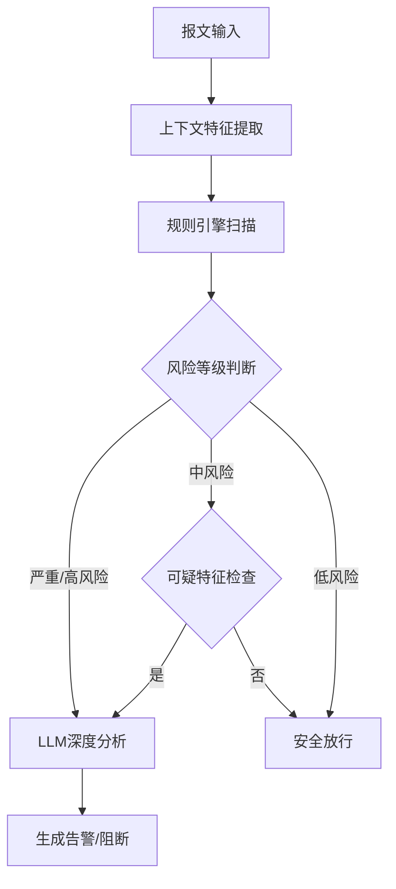

# 网络攻击检测智能体 - 工作流编排说明

## 概述

本系统是一个基于工作流编排的网络攻击检测智能体，通过多个模块的协同工作，实现对网络流量的实时安全检测和威胁分析。

## 系统架构

### 核心组件

1. **报文输入模块** (`packet_input`)
   - 接收旁路镜像转发的HTTP请求报文
   - 解析报文结构和基础信息
   - 执行初步验证和异常检测

2. **上下文特征提取模块** (`context_extraction`)
   - 提取IP、URL、时间等维度的行为特征
   - 统计访问频率、错误率等上下文信息
   - 计算风险指标和异常评分

3. **规则引擎与扫描函数模块** (`rule_engine`)
   - 内置多种攻击类型的专家检测规则
   - 基于签名和行为模式进行威胁识别
   - 输出攻击类型、风险等级和置信度

4. **LLM深度研判模块** (`llm_analysis`)
   - 对高风险和可疑请求进行深度分析
   - 生成详细的威胁评估报告
   - 提供专业的防护建议

### 工作流程



## 部署配置

### 1. 环境要求

- Python 3.8+
- 支持工作流编排的Agent平台
- LLM API接入（如GPT-4、Claude等）

### 2. 模块配置

#### 报文输入模块
```json
{
  "type": "python_module",
  "function": "execute_packet_input",
  "input": "raw_packet_data",
  "timeout": 5
}
```

#### 上下文特征提取模块
```json
{
  "type": "python_module", 
  "function": "execute_context_feature_extraction",
  "input": "{{packet_input.output}}",
  "timeout": 10
}
```

#### 规则引擎模块
```json
{
  "type": "python_module",
  "function": "execute_rule_engine_scan", 
  "inputs": {
    "packet_data": "{{packet_input.output}}",
    "context_features": "{{context_extraction.output}}"
  },
  "timeout": 15
}
```

#### LLM分析模块
```json
{
  "type": "llm_module",
  "model": "gpt-4",
  "temperature": 0.1,
  "max_tokens": 2000,
  "prompt_generator": "generate_llm_prompt",
  "timeout": 30
}
```

### 3. 决策逻辑配置

#### 风险等级决策
```json
{
  "type": "switch_case",
  "condition_field": "risk_level",
  "cases": [
    {"condition": "严重", "next": "llm_analysis"},
    {"condition": "高风险", "next": "llm_analysis"},
    {"condition": "中风险", "next": "suspicious_check"},
    {"condition": "低风险", "next": "safe_pass"}
  ]
}
```

#### 可疑特征检查
```json
{
  "type": "switch_case",
  "condition_field": "requires_llm_analysis",
  "cases": [
    {"condition": true, "next": "llm_analysis"},
    {"condition": false, "next": "safe_pass"}
  ]
}
```

## 支持的攻击类型

### 1. Web应用攻击
- SQL注入 (SQLi)
- 跨站脚本攻击 (XSS)
- 跨站请求伪造 (CSRF)
- 命令注入 (Command Injection)
- 目录遍历 (Directory Traversal)
- XXE注入
- SSRF攻击
- 反序列化攻击

### 2. 网络层攻击
- DDoS攻击
- 暴力破解攻击
- 扫描器探测

### 3. 行为异常
- 异常访问频率
- 可疑User-Agent
- 异常编码模式
- 会话异常

## 性能指标

### 处理能力
- 单个报文处理时间: < 100ms (无LLM分析)
- 单个报文处理时间: < 5s (包含LLM分析)
- 并发处理能力: 1000+ requests/second

### 检测准确性
- 误报率目标: < 5%
- 漏报率目标: < 2%
- 检测覆盖率: > 95%

## 监控和告警

### 关键指标监控
- 处理延迟
- 攻击检出率
- 误报率
- 系统吞吐量
- 错误率

### 告警配置
- 处理时间超过10秒
- 错误率超过5%
- 攻击检出异常增长
- 系统资源使用异常

## 扩展和优化

### 1. 规则引擎扩展
- 添加新的攻击签名
- 优化检测规则的准确性
- 支持自定义规则配置

### 2. 特征工程优化
- 增加更多上下文特征
- 优化特征提取算法
- 支持机器学习特征选择

### 3. LLM模型优化
- 针对安全场景的模型微调
- 提示词工程优化
- 多模型集成决策

## 使用示例

### 基本配置示例
```python
# 工作流配置
workflow_config = {
    "name": "network_security_detection",
    "nodes": [
        {
            "id": "packet_input",
            "type": "python_module",
            "function": "execute_packet_input"
        },
        # ... 其他节点配置
    ],
    "edges": [
        {"from": "packet_input", "to": "context_extraction"},
        # ... 其他连接配置
    ]
}
```

### 输入数据格式
```json
{
  "timestamp": "2024-01-15T10:30:00Z",
  "source_ip": "192.168.1.100",
  "method": "POST",
  "url": "/login.php",
  "headers": {
    "Host": "example.com",
    "User-Agent": "Mozilla/5.0...",
    "Content-Type": "application/x-www-form-urlencoded"
  },
  "body": "username=admin&password=123456"
}
```

### 输出结果格式
```json
{
  "detection_result": {
    "is_attack": true,
    "attack_types": ["SQL注入"],
    "risk_level": "高风险",
    "confidence": 0.85,
    "recommendations": [
      "立即阻断该IP地址",
      "检查应用程序SQL查询参数化"
    ]
  },
  "llm_analysis": {
    "threat_assessment": "检测到明确的SQL注入攻击...",
    "impact_evaluation": "可能导致数据库信息泄露...",
    "response_suggestions": ["immediate", "short_term", "long_term"]
  }
}
```

## 故障排除

### 常见问题
1. **处理超时**: 检查LLM API响应时间，调整超时配置
2. **误报率高**: 优化规则引擎阈值，增加白名单机制
3. **性能瓶颈**: 启用并发处理，优化特征提取算法

### 日志分析
- 查看各模块的处理时间
- 分析错误日志和异常堆栈
- 监控资源使用情况

## 更新和维护

### 定期维护任务
- 更新攻击签名库
- 优化检测规则
- 清理历史数据
- 性能调优

### 版本升级
- 向后兼容性检查
- 配置文件迁移
- 功能回归测试